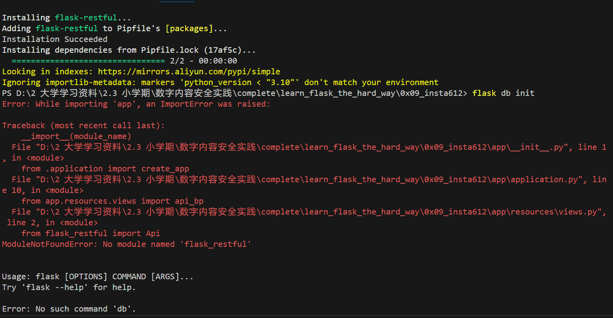
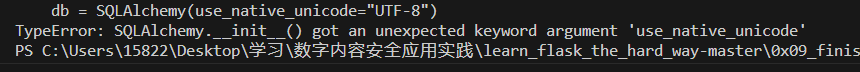

# 实验报告

## 实验目的

- 用Python实现一个基于数字水印的隐蔽通信系统

## 实验分工

- wind：前端部分

- ArrebolY：整合测试

- cucszh：算法部分

- huihui：后端部分

## 系统实现功能介绍

- 


## 改进的部分

### 1. 网页重定向

- 在通过网页提交博文后，返回的内容是一段 `json` 字符串，我们希望将其修改为跳转到展示新博文的页面。


- 对 `learn_flask_the_hard_way\0x09_insta612\app\resources\post.py` 中的 `PostList` 类的返回值进行修改

```py
#修改前
return {"msg": "post created", "post": schema.dump(post)}, 201
#修改后
return redirect(url_for('home.index'))
```

- 跳转验证：

<video width="800" height="300" controls>
  <source src="imgs/redirect.mp4" type="video/mp4">
</video>


## 运行时遇到的问题与解决方式

### 1. 在 `pipenv install` 后运行 `flask db init` 时出现缺少模块的报错：



可以删除 `C:\Users\86186\.virtualenvs` 目录下的虚拟环境文件，并重新创建虚拟环境

### 2. 此时可能会出现另一个关于编码的报错：



这是因为新的 `python` 版本中是含有 `UTF-8` 编码的，因此可以找到文件中的 `learn_flask_the_hard_way\0x09_insta612\app\extensions.py` 进行修改

```py
#修改前
db = SQLAlchemy(use_native_unicode="UTF-8")
#修改后
db = SQLAlchemy()
```


