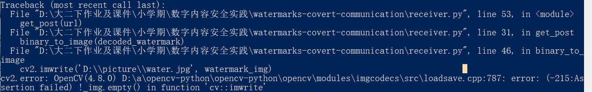
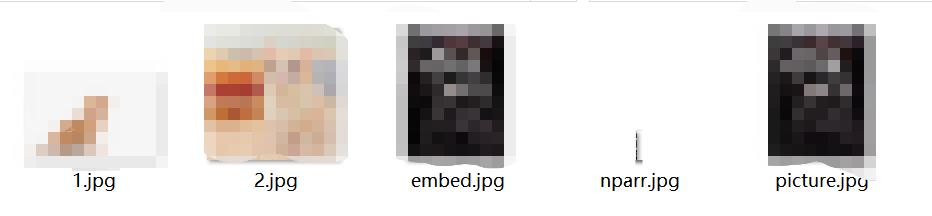

# 实验报告

## 实验目的

- 用Python实现一个基于数字水印的隐蔽通信系统

## 实验分工

- wind：前端部分

- ArrebolY：整合测试

- cucszh：算法部分

- huihui：后端部分

## 系统实现功能介绍

- 使用sender.py将想要上传的图片中添加水印上传到服务器

- 使用receiver.py将图片下载并提取水印


## 改进的部分

### 1. 网页重定向

- 在通过网页提交博文后，返回的内容是一段 `json` 字符串，我们希望将其修改为跳转到展示新博文的页面。

- 可以对 `learn_flask_the_hard_way\0x09_insta612\app\resources\post.py` 中的 `PostList` 类的返回值进行修改

```py
#修改前
return {"msg": "post created", "post": schema.dump(post)}, 201
#修改后
return redirect(url_for('home.index'))
```

- 跳转验证：[点这里观看](https://www.bilibili.com/video/BV1nu411G7UY/?spm_id_from=333.999.0.0&vd_source=11bedaab6369e0cb458e3a995d5a8d1d)

<video width="800" height="300" controls>
  <source src="imgs/redirect.mp4" type="video/mp4">
</video>


### 2. 对于在图片载体上嵌入图片水印的尝试

- 具体方案：

1. 设计一个图片转换为二进制的函数：

```py
watermark_path = r''
# 将水印图片变为二进制
def image_to_binary(watermark_path):
    watermark_path = r''
    with open(watermark_path, 'rb') as f:
        img = cv2.imread(watermark_path)
        img_byte_arr = cv2.imencode('.jpg', img)[1].tobytes()
    return img_byte_arr
```


2. 在embed_watermark函数和extract_watermark函数里面更改有关水印的数据，下面为引用watermark_encode函数将水印扩频加密

```py
# 将水印转换为2进制数据

    global en_watermark
    en_watermark = watermark_encode(img_byte_arr)
    
    iHeight, iWidth = img.shape
```

3. 在receiver.py中设计一个函数binary_to_image，用来将已嵌入的图片提取出来并写入
```python
# 将二进制数据变为图片
def binary_to_image(binary_data):
    # 将二进制数据转换为 numpy 数组
    nparr = np.frombuffer(binary_data.encode(), 'u1')
    
    # 将 numpy 数组解码为图像
    watermark_img = cv2.imdecode(nparr, cv2.IMREAD_COLOR)
    # 将图像保存为文件
    try:
        cv2.imwrite('D:\picture\water.jpg', watermark_img)
    except cv2.error as e:
        print(e)
    
```
4.在embed_watermark函数和extract_watermark函数里面更改有关水印的数据

    # 将水印转换为2进制数据

    global en_watermark
    en_watermark = watermark_encode(img_byte_arr)
    
    iHeight, iWidth = img.shape

    countHeight = int(iHeight / 8)
    countWidth = int(iWidth / 8)

在这一过程中，又遇到了一个困扰了我很长时间的一个问题，就是这个参数en_watermark，它到底是以怎样的一种形态存储的？
刚开始的时候，我以为它是一个字符串，但是后来我发现它可能只是一个数字，所以就对它的存储状态进行了很多次的更改

而且在这个过程中en_watermark经常报错提前调用了该变量，我在网站上面搜索的办法是需要做global定义，将它定义为全局变量。

最后结果为图片可以嵌入做水印，但在最后的提取会有错误，所以我思考会不会是因为参数这方面的失误导致了后面的工作无法正常进行。

## 代码解读及Flask框架理解

- html使用了jinja2模板，完成了每次刷新都会从后台调取数据的任务，实现动态页面。

- blueprints规定了在指定地址下使用哪个python文件，为前端传送哪些参数
以"/"为例，定位到auth/view.py文件中，对文件进行阅读，发现在/login路径中，如果满足条件将会将form作为参数传递给login.html。使用jinja2还可以对此数据进行各种处理，以此为基础，我们可以为不管是网页直接上传，还是使用send脚本上传的图片中都添加水印   

- app.py也就是app中__init__  

- base.html和home.html等均使用模板继承方式实现前端页面，它可以使伟大的前端工程师工作量降低，在修改页面的时候不用每一个都改一遍，而是直接改 **某一个** 模板文件  

- post.py文件中的PostList类实现了重定向功能，操作完成后将回到主页。在这个文件中，还有读取和检验用户传递的数据的功能

## 实验收获

- 学习了jinja2的写法与用法

- 学习了表单的写法与用法

- 学习了不同模块间相互透明的思维（前后端分离，jinja2模板后端只负责将参数扔给前端）

- 学习了图像隐写的算法原理

- 学习了Flask模板继承原理

- 学习了路由、API接口


## 运行时遇到的问题与解决方式

### 1. 在 `pipenv install` 后运行 `flask db init` 时出现缺少模块的报错：


可以删除 `C:\Users\86186\.virtualenvs` 目录下的虚拟环境文件，并重新创建虚拟环境

### 2. 此时可能会出现另一个关于编码的报错：


这是因为新的 `python` 版本中是含有 `UTF-8` 编码的，因此可以找到文件中的 `learn_flask_the_hard_way\0x09_insta612\app\extensions.py` 进行修改

```py
#修改前
db = SQLAlchemy(use_native_unicode="UTF-8")
#修改后
db = SQLAlchemy()
```

### 3. 在修改sender.py的时候出现如下报错：


因为我的想法其实是将水印图片转换为二进制存储在参数中，然后再使用扩频等方法将它进行加密，加密之后就可以跟之前的代码一样嵌入到图片当中。但是在图片转化为二进制这过程中，我遇到了一些问题，主要就在于这些参数之间的转换。

最后我求助了老师，并了解了imread的使用方法，最后解决了这个报错。

在写这个函数的时候，同样也有将tostring()转换为tobytes()，如下：


不赞成使用tostring

### 4. 关于在图片载体上嵌入图片水印的尝试时，图片无法提取的问题：



报错的意思是，认为要写入的图像是空的

首先进行一个排错，对于receiver.py的提取代码，修改为：
```python
ef binary_to_image(binary_data):
    # 将二进制数据转换为 numpy 数组
    nparr = np.frombuffer(binary_data.encode(), 'u1')
    cv2.imwrite('D:\picture\\nparr.jpg', nparr)
    # 将 numpy 数组解码为图像
    watermark_img = cv2.imdecode(nparr, cv2.IMREAD_COLOR)
    # 将图像保存为文件
    try:
        cv2.imwrite('D:\picture\water.jpg', watermark_img)
    except cv2.error as e:
        print(e)

    # cv2.imwrite('D:\\picture\\water.jpg', watermark_img)
```
添加cv2.imwrite('D:\picture\\nparr.jpg', nparr)，将numpy数组作为图片写入，来验证是哪一步出现了错误，结果如下：



证明并不是在nparr = np.frombuffer(binary_data.encode(), 'u1')出现了错误，那么就说明imdecode出了错，查询文档可知cv2.imdecode(buf,flags)如果给定的 buf 不是图像数据，则将返回NULL。

暂时无法找到解决方法。